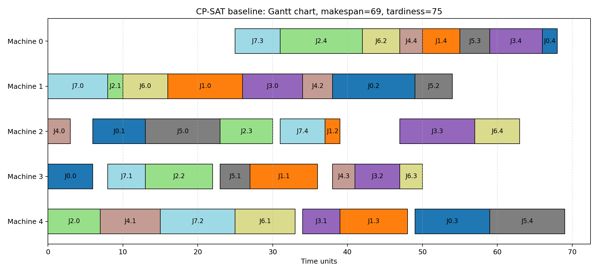
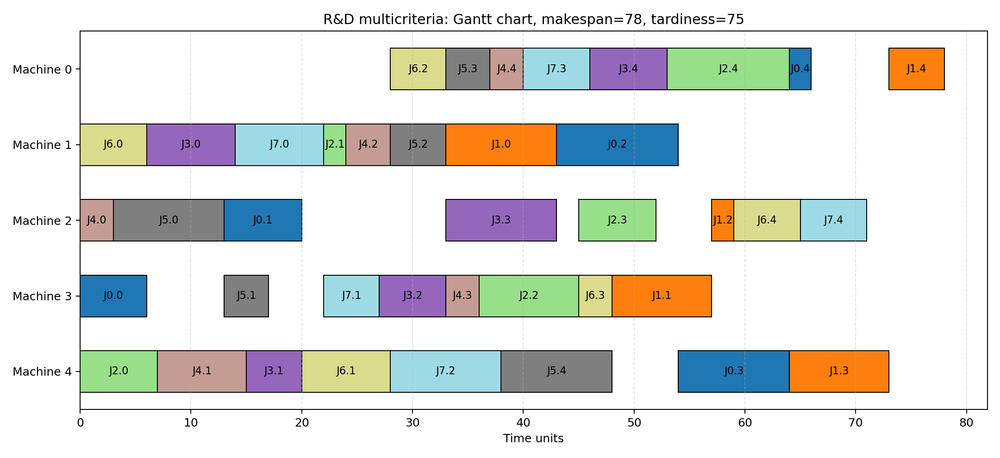
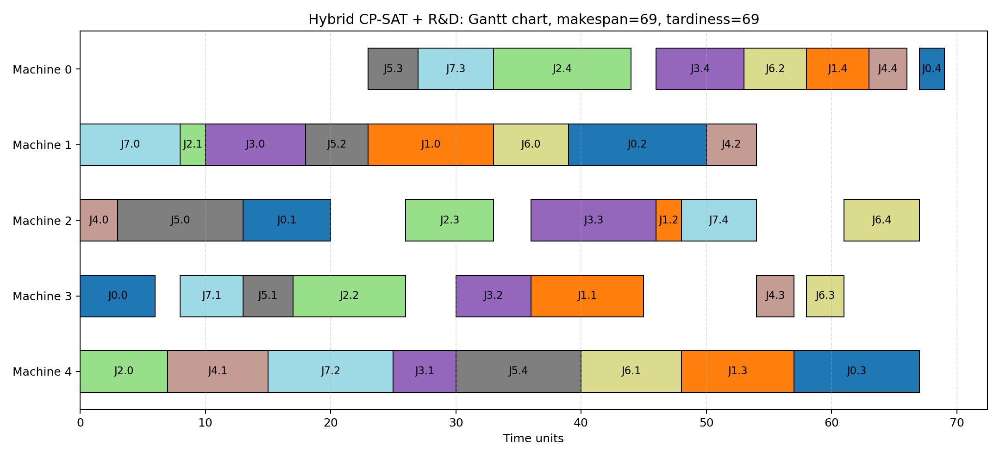
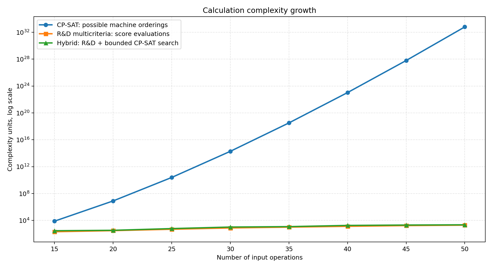
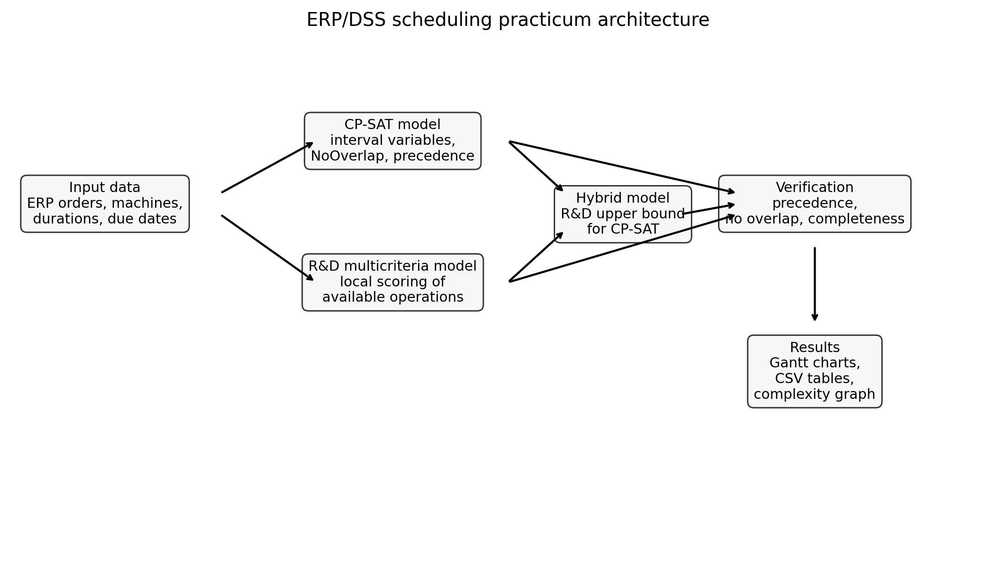

# ERP/DSS Scheduling Practicum

## Опис

**ERP/DSS Scheduling Practicum** — навчальний проєктний практикум з дисципліни **"Технології Data Science"**.

Проєкт реалізує макет інтелектуальної ERP/DSS системи підтримки прийняття рішень для задачі складання виробничих розкладів. Основна задача — порівняти класичний CP-SAT підхід із R&D багатокритеріальною моделлю та показати, як евристичний багатокритеріальний підхід може скоротити кількість розрахункових операцій.

У проєкті реалізовано три гілки дослідження:

- `A` — **CP-SAT baseline**: класична оптимізаційна модель job-shop scheduling через Google OR-Tools;
- `B` — **R&D multicriteria dispatching**: швидка багатокритеріальна модель вибору наступної операції;
- `A+B` — **Hybrid CP-SAT + R&D**: гібридний підхід, де R&D модель формує верхню межу `makespan` для CP-SAT.

Основне дослідження виконується як порівняння `A` та `B`. Гілка `A+B` використовується як додатковий інноваційний підхід до підвищення продуктивності CP-SAT задач.

## Що реалізує pipeline

Основний pipeline у [`scripts/run_experiment.py`](scripts/run_experiment.py) виконує такі етапи:

- generation: детермінована генерація виробничих замовлень, машин, тривалостей операцій, дедлайнів і пріоритетів;
- CP-SAT baseline: побудова класичної моделі розкладу з `IntervalVar`, `NoOverlap` та precedence constraints;
- R&D multicriteria scheduling: побудова допустимого розкладу через багатокритеріальний скоринг доступних операцій;
- Hybrid optimization: запуск CP-SAT з верхньою межею `makespan`, отриманою від R&D моделі;
- verification: перевірка повноти операцій, технологічної послідовності та відсутності перетинів на машинах;
- visualization: побудова діаграм Ганта та графіка складності;
- reporting: формування CSV-таблиць через `pandas` і PNG-графіків у `reports`.

Основна логіка знаходиться у [`src/project_practicum.py`](src/project_practicum.py).

## Математичні моделі

### A. CP-SAT baseline

CP-SAT модель формалізує задачу як job-shop scheduling:

- кожна операція має `start`, `end` та `interval` змінні;
- операції одного замовлення виконуються у заданій послідовності;
- одна машина не може виконувати кілька операцій одночасно;
- цільова функція мінімізує `makespan`, тобто загальну довжину розкладу.

Ключове ресурсне обмеження:

```python
model.AddNoOverlap(intervals)
```

Цільова функція:

```python
model.Minimize(makespan_var)
```

### B. R&D multicriteria dispatching

R&D модель не перебирає весь простір можливих розкладів. На кожному кроці вона розглядає лише доступні наступні операції та обирає найкращу за інтегральним score:

```text
score = 0.35 * earliest_start
      + 0.25 * SPT
      + 0.20 * slack
      + 0.10 * remaining_work
      + 0.10 * priority
```

Критерії:

- `earliest_start` — раніший можливий старт операції;
- `SPT` — коротша тривалість операції;
- `slack` — менший запас часу до дедлайну;
- `remaining_work` — більший залишок роботи у замовленні;
- `priority` — вища бізнес-важливість замовлення.

У демонстраційному шаблоні багатокритеріальна модель застосовується для вибору найкращої альтернативи з таблиці. У цьому проєкті альтернативами є доступні операції розкладу, а інтегрований score використовується для вибору наступної операції.

### A+B. Hybrid CP-SAT + R&D

Гібридний підхід використовує R&D модель як швидкий попередній планувальник:

1. R&D модель формує допустимий розклад.
2. Її `makespan` передається в CP-SAT як верхня межа.
3. CP-SAT шукає розклад не гірший за евристичний.

Додаткове обмеження:

```python
model.Add(makespan_var <= makespan_upper_bound)
```

Цей підхід не замінює baseline-порівняння `A` проти `B`, а демонструє, як R&D результат може бути використаний для підвищення продуктивності CP-SAT пошуку.

## Основні результати

Базовий експеримент виконано для `8` замовлень і `5` машин.

| Метод | Makespan | Total tardiness | Complexity units |
|---|---:|---:|---:|
| CP-SAT baseline | 69 | 75 | 106562062388507443200000 |
| R&D multicriteria | 78 | 75 | 1345 |
| Hybrid CP-SAT + R&D | 69 | 69 | 1826 |

`Complexity units` використовується як порівняльна проксі-метрика:

- для CP-SAT baseline — оцінка комбінаторного простору можливих порядків операцій на машинах;
- для R&D моделі — кількість скорингових оцінювань кандидатів;
- для Hybrid — сума R&D-оцінювань і фактичних пошукових дій CP-SAT після додавання верхньої межі.

Ключовий висновок: CP-SAT дає найкращий `makespan`, але має значно більший комбінаторний простір. R&D модель будує допустимий розклад з невеликим погіршенням `makespan`, але з набагато меншою кількістю розрахункових операцій. Hybrid-гілка поєднує швидкий R&D результат із точністю CP-SAT.

## Артефакти

### Діаграми Ганта

CP-SAT baseline:



R&D multicriteria:



Hybrid CP-SAT + R&D:



### Графік складності



### Архітектура



### Табличні результати

- [`reports/tables/schedule_cp_sat.csv`](reports/tables/schedule_cp_sat.csv);
- [`reports/tables/schedule_multicriteria.csv`](reports/tables/schedule_multicriteria.csv);
- [`reports/tables/schedule_hybrid.csv`](reports/tables/schedule_hybrid.csv);
- [`reports/tables/complexity_results.csv`](reports/tables/complexity_results.csv).

## Верифікація

Для кожного з трьох розкладів автоматично перевіряється:

- кожна операція присутня рівно один раз;
- тривалість кожної операції збережена;
- порядок операцій у межах одного замовлення не порушений;
- на одній машині немає перетинів операцій.

Перевірка реалізована функцією `verify_schedule()` у [`src/project_practicum.py`](src/project_practicum.py).

## Структура проєкту

```text
.
|-- src/
|   |-- __init__.py              # службовий файл Python-пакета
|   `-- project_practicum.py     # генерація даних, CP-SAT, R&D, Hybrid, верифікація, графіки
|-- scripts/
|   `-- run_experiment.py        # основний сценарій запуску експерименту
|-- reports/
|   |-- figures/
|   |   |-- architecture.png              # структурна схема pipeline
|   |   |-- complexity_comparison.png     # графік складності A / B / A+B
|   |   |-- gantt_cp_sat.png              # діаграма Ганта для CP-SAT baseline
|   |   |-- gantt_hybrid.png              # діаграма Ганта для Hybrid CP-SAT + R&D
|   |   `-- gantt_multicriteria.png       # діаграма Ганта для R&D multicriteria
|   `-- tables/
|       |-- complexity_results.csv        # порівняння складності, часу та якості
|       |-- schedule_cp_sat.csv           # табличний розклад CP-SAT baseline
|       |-- schedule_hybrid.csv           # табличний розклад Hybrid CP-SAT + R&D
|       `-- schedule_multicriteria.csv    # табличний розклад R&D multicriteria
|-- requirements.txt              # Python-залежності
|-- README.md                     # документація проєкту
|-- .gitignore                    # правила виключення службових файлів із Git
`-- LICENSE                       # ліцензія проєкту
```

## Як запустити

Встановити залежності:

```bash
pip install -r requirements.txt
```

Запустити основний експеримент:

```bash
python scripts/run_experiment.py
```

Запустити з іншими параметрами:

```bash
python scripts/run_experiment.py --jobs 10 --machines 5 --time-limit 5
```

Після запуску результати зберігаються в:

- [`reports/figures/`](reports/figures/);
- [`reports/tables/`](reports/tables/).

Якщо результатний PNG або CSV відкритий у редакторі й Windows блокує перезапис, скрипт не зупиняється, а створює нумеровану копію на кшталт `schedule_cp_sat_latest_1.csv`.

## Технології

- Python;
- Google OR-Tools;
- NumPy;
- pandas;
- matplotlib.

## Покриття вимог практикуму

| Вимога | Де реалізовано | Статус |
|---|---|---|
| R&D дослідження задачі складання розкладів | `src/project_practicum.py`, `README.md` | реалізовано |
| CP-SAT математична модель | `solve_with_cp_sat()` | реалізовано |
| Багатокритеріальна модель | `solve_with_multicriteria_dispatching()` | реалізовано |
| Програмний скрипт розв'язку | `scripts/run_experiment.py` | реалізовано |
| Порівняння CP-SAT та R&D | `reports/tables/complexity_results.csv` | реалізовано |
| Діаграми Ганта | `reports/figures/gantt_*.png` | реалізовано |
| Графік залежності складності від розміру вхідних даних | `reports/figures/complexity_comparison.png` | реалізовано |
| Інноваційний підхід до підвищення продуктивності CP-SAT | Hybrid `A+B` з R&D upper bound | реалізовано |
| Тестування та верифікація | `verify_schedule()` | реалізовано |

## English Summary

**ERP/DSS Scheduling Practicum** is an educational Data Science project focused on decision support for job-shop scheduling. It compares three scheduling branches: a classic CP-SAT baseline, an R&D multicriteria dispatching heuristic, and a hybrid CP-SAT model bounded by the R&D solution.

The project generates deterministic production orders, builds schedules, verifies feasibility, exports Gantt charts, and compares calculation complexity as the input size grows.

To run:

```bash
pip install -r requirements.txt
python scripts/run_experiment.py
```

Generated figures and tables are stored in `reports/figures/` and `reports/tables/`.
